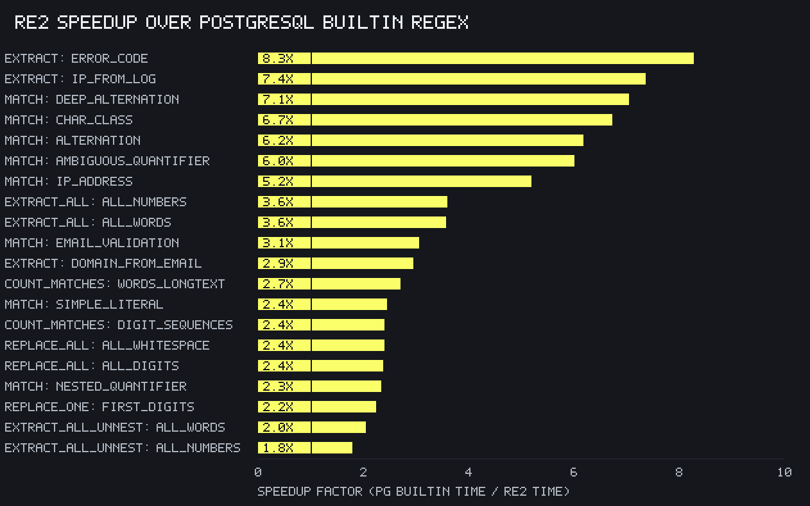
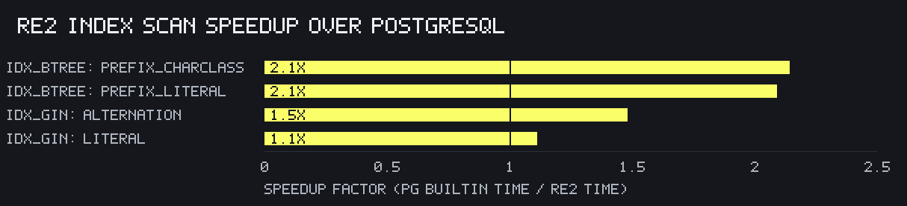

Compares `re2` throughput against PostgreSQL builtin [POSIX regex (ARE)](https://www.postgresql.org/docs/current/functions-matching.html)



| Category       | re2                       | builtin                       |
| -------------- | ------------------------- | ----------------------------- |
| match          | `re2match`                | `regexp_like`                 |
| extract        | `re2extract`              | `regexp_substr`               |
| extract all    | `re2extractall`           | `regexp_matches(…, 'g')`      |
| replace one    | `re2replaceregexpone`     | `regexp_replace`              |
| replace all    | `re2replaceregexpall`     | `regexp_replace(…, 'g')`      |
| count matches  | `re2countmatches`         | `regexp_count`                |

Patterns span literal, character class, alternation, nested quantifier, IP /
email validation, deep alternation, and a ReDoS-shaped `(e?){10}e{10}` case.
Both RE2 (automaton) and PG (ARE) handle last one without catastrophic
backtracking

Data is 10000 rows of:

- `email` ~40 chars
- `logline` ~200 chars
- `longtext` ~2000 chars (400 words)

Index scans
-----------

`re2` also speeds up `re2match` through two index mechanisms (see [Index
Support]). These queries compare each against the equivalent PostgreSQL index
scan over a separate 100000-row table.

| Mechanism           | re2                          | postgres                     |
| ------------------- | ---------------------------- | ---------------------------- |
| b-tree prefix range | `re2match(col, '^lit')`      | `col ~ '^lit'`               |
| GIN trigram         | `col @~ pat` (`gin_re2_ops`) | `col ~ pat` (`gin_trgm_ops`) |



The two GIN opclasses extract keys differently. `pg_trgm` builds trigrams from
alphanumeric words only (never spanning `_`, `=`, …) and prunes extracted
trigrams under a fixed penalty budget tuned for natural-language text;
`gin_re2_ops` keeps every byte trigram of each literal atom RE2's `FilteredRE2`
requires. On punctuated machine-text patterns (e.g. `error_code=42[0-9]` over
loglines where `error_code=` appears in every row) pruning can leave `pg_trgm`
with only ubiquitous trigrams, degenerating to a full-index scan while
`gin_re2_ops` stays selective, an order of magnitude faster. On plain-word
patterns both extract similar keys and `pg_trgm`'s cheaper consistent check
can win (see `error_code=123` above).

Methodology
-----------

- JIT and query parallelism disabled to compare single-thread engine throughput reliably
- `gen_graph.py` takes the median time per (pattern, engine) across all iterations
- Index scans use a `text_pattern_ops` b-tree and two GIN indexes on one table;
  `enable_seqscan` is off there so both engines are measured on their index

Running
-------

Requires `re2` (see [README]) and PostgreSQL 15+ for builtin comparisons.
The index-scan section additionally needs the `pg_trgm` contrib extension;
`setup.sql` creates it.

Connection uses libpq environment variables; override the `psql` binary with
`PSQL`:

``` sh
PGDATABASE=mydb ./run_bench.sh        # 5 iterations (default)
PGDATABASE=mydb ./run_bench.sh 10     # 10 iterations
./gen_graph.py                        # regenerate graph.png & graph_index.png
```

  [README]: ../README.md
  [Index Support]: ../doc/re2.md#index-support
